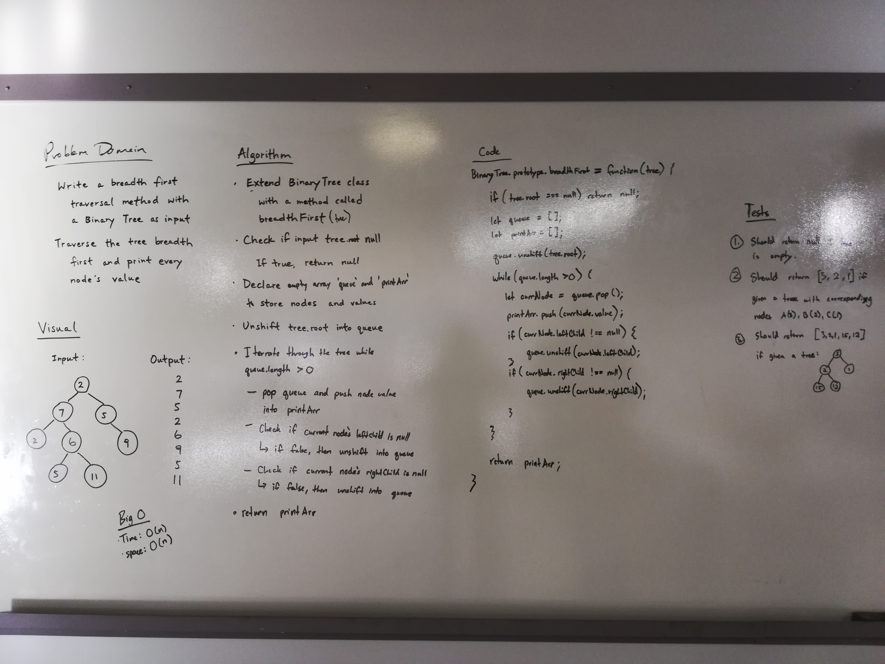

# Breadth-first

## Challenge
Write a breadth first traversal method which takes a Binary Tree as its unique input. Without utilizing any of the built-in methods available to your language, traverse the input tree using a Breadth-first approach and print every visited node’s value.

## Approach & Efficiency
We took the approach of declaring an empty array called queue to store the nodes as we iterate through the tree and an empty array called printArr to store their values. We begin by adding the root node onto queue. As long as queue is not empty, we will pop a node off of it and push the node's value onto printArr. If the left child of that node is not null, we will unshift the left child onto queue. If the right child of that node is not null, we will unshift the right child onto queue. In the end, we will return printArr.

The Big O time for the breadthFirst method is O(n). The Big O space for the breadthFirst method is O(n).

## Solution

