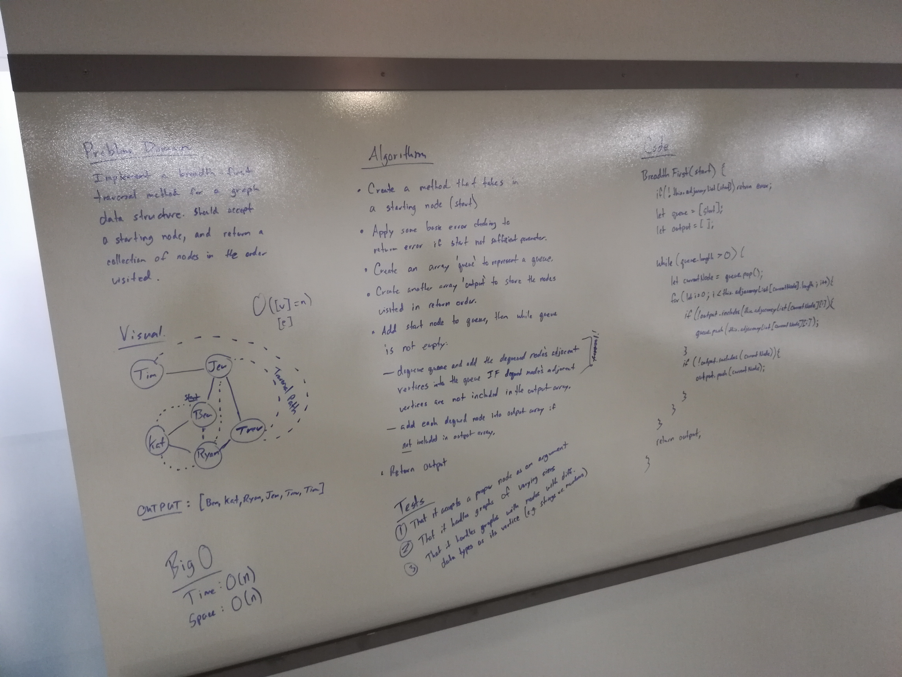

# Breadth-First Traversal of a Graph

Katherine Smith & Ben Harris

## Challenge
- Extend your graph object with a breadth-first traversal method that accepts a starting node. 
- Without utilizing any of the built-in methods available to your language, return a collection of nodes in the order they were visited.

## Approach & Efficiency
We took the approach of using an array for our queue and an array for our output. We first queue the starting node. While the length of the queue is greater than 0, we dequeue a node from the queue and find its neighbors. We then enqueue the neighbors that are not in the output array. We also check if the dequeued node is in the output array. If not, we push it into the output array. After the while loop ends, we return the output array.

The Big O Time for this method is O(n). The Big O Space for this method is O(n).

## Solution
