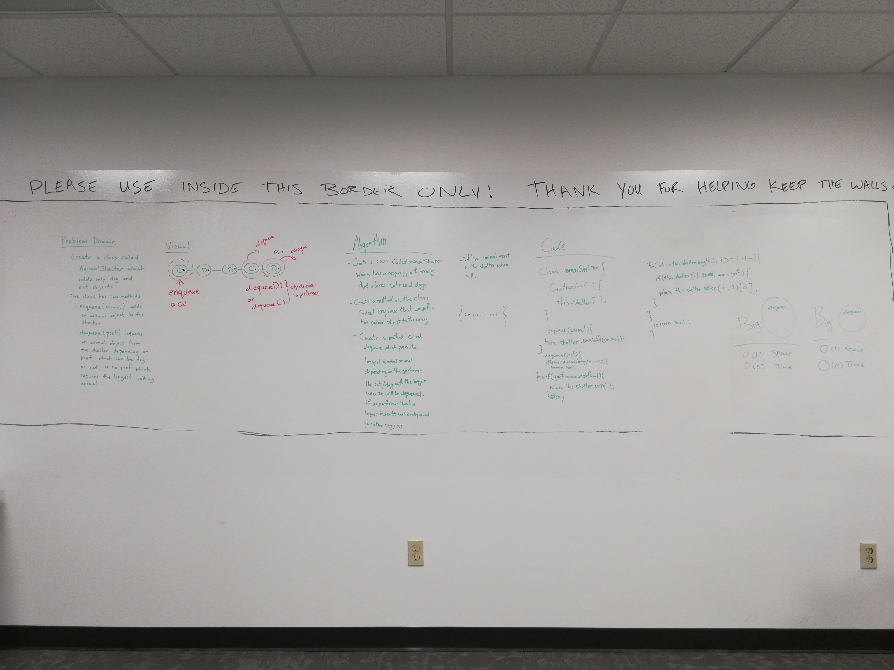

# First-in, First out Animal Shelter.

## Challenge
- Create a class called AnimalShelter which holds only dogs and cats. The shelter operates using a first-in, first-out approach.
- Implement the following methods:
    - enqueue(animal): adds animal to the shelter. animal can be either a dog or a cat object.
    - dequeue(pref): returns either a dog or a cat. If pref, a string, is ‘cat’ return the longest-waiting cat. If pref is ‘dog’, return the longest-waiting dog. For anything else, return either a cat or a dog.

## Approach & Efficiency
We took the approach of representing our animal shelter with an array and using array methods to enqueue and dequeue our animal shelter. The Big O time for both enqueueing and dequeueing is O(n). The Big O space for both enqueueing and dequeuing is O(1).

## Solution
