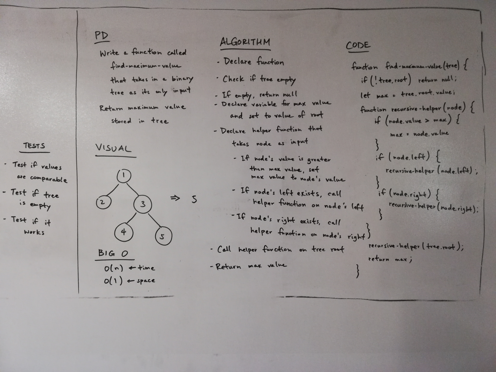

# Find the Maximum Value in a Binary Tree

## Challenge
Write a function called findMaximumValue which takes binary tree as its only input. Without utilizing any of the built-in methods available to your language, return the maximum value stored in the tree. You can assume that the values stored in the Binary Tree will be numeric.

## Approach & Efficiency
We took the approach of declaring a variable called max to store the maximum value. We then iterate through each node of the tree in preOrder and changing max to the value of the node if the value of the node is greater than max. We then return max.

The Big O time for the findMaximumValue function is O(n). The Big O space for the findMaximumValue function is O(1).

## Solution

