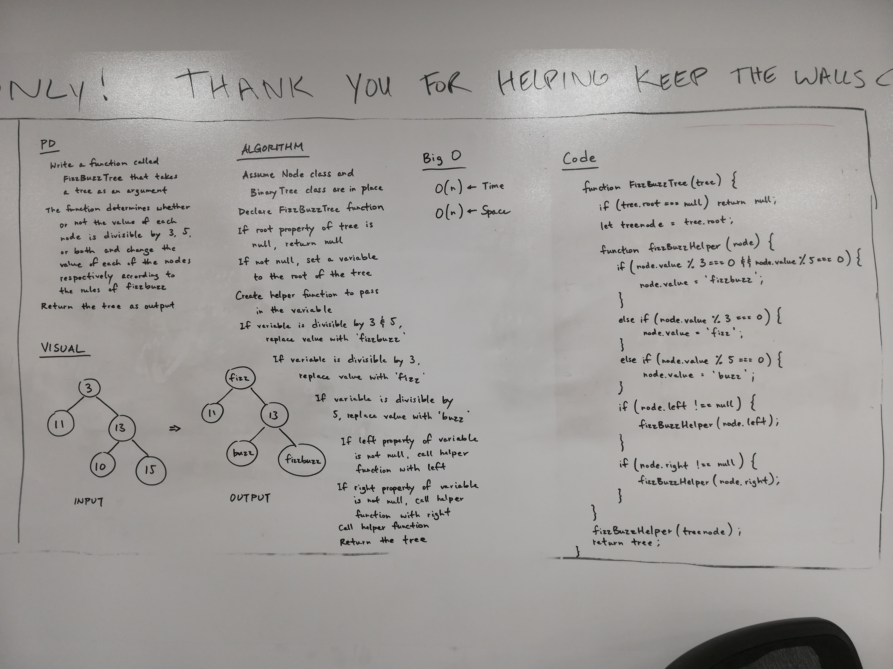

# FizzBuzz Tree

## Challenge
- Write a function called FizzBuzzTree which takes a tree as an argument.
- Without utilizing any of the built-in methods available to your language, determine whether or not the value of each node is divisible by 3, 5 or both, and change the value of each of the nodes respectively. Return the tree with its new values.

## Approach & Efficiency
We took the approach of going through each node of the tree in preOrder and changing the value of each node according to the rules of FizzBuzz. 

The Big O time for the FizzBuzzTree function is O(n). The Big O space for the FizzBuzzTree function is O(n).

## Solution

