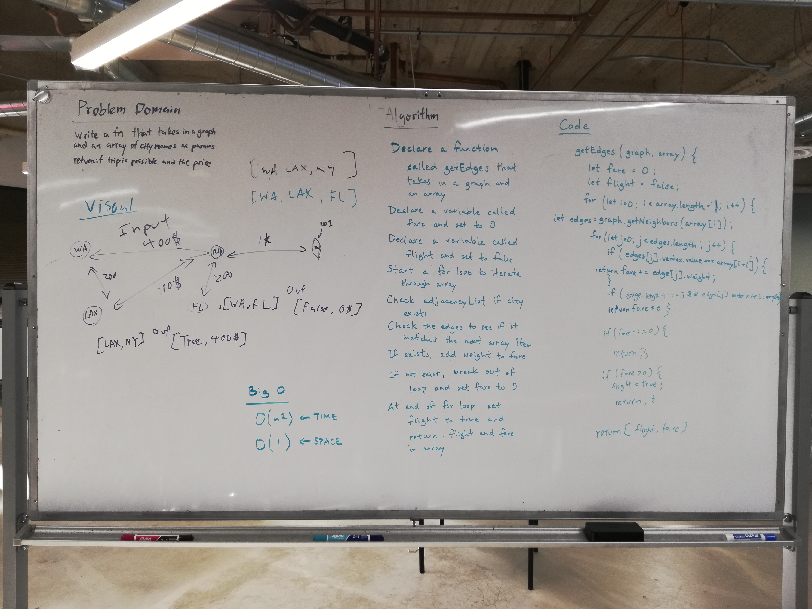

# Find Edges

Katherine Smith & Timothy Li

## Challenge
- Write a function based on the specifications above, which takes in a graph, and an array of city names.
- Without utilizing any of the built-in methods available to your language, return whether the full trip is possible with direct flights, and how much it would cost.

## Approach & Efficiency
- We took the approach of declaring a variable to store the fare. 
- We then use the getNodes() method on the input graph and store the vertices of the graph in an array (vertices array).
- Next, we start iterating through the input array of city names.
  - In each iteration, we find the vertex in the vertices array that has the current city name as its value. 
  - We call the getNeighbors() method on the input graph with that vertex and store the edges of that vertex in an array (edges array).
  - We then iterate through the edges array to find out if any of the edges have the next city name as its value. 
    - If so, we add the weight of that edge to the fare variable and break out of the edges array for loop.
    - If not, we return false and a fare of 0.
- If iteration through the city names array finishes, we return true and the final fare amount.

The Big O Time for this method is O(n^2). The Big O Space for this method is O(n).

## Solution
