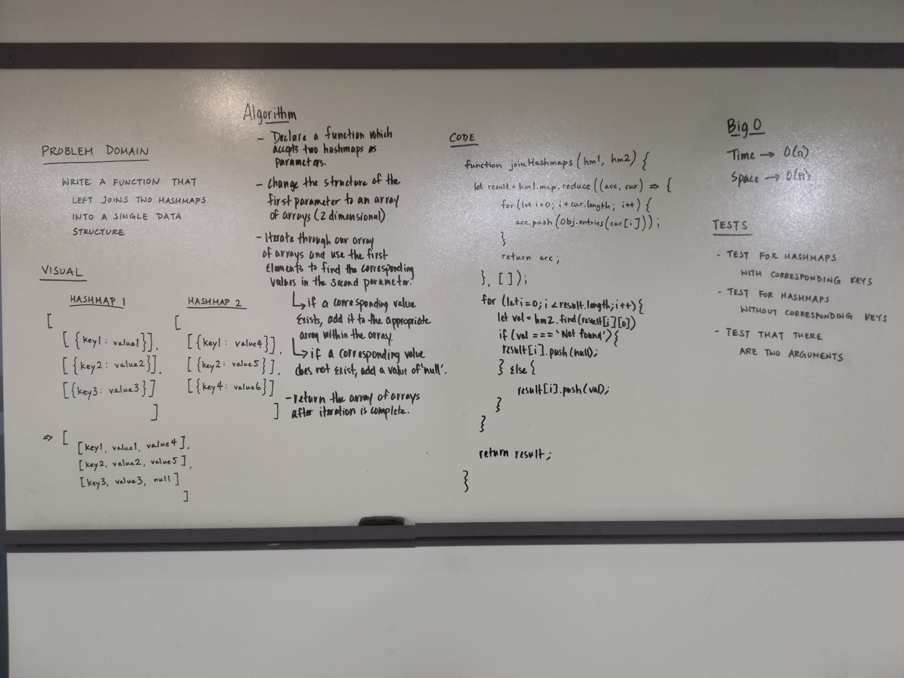

# Hashmap LEFT JOIN

Katherine Smith & George McCadden III

## Challenge
- Write a function that LEFT JOINs two hashmaps into a single data structure.
- The first parameter is a hashmap that has word strings as keys, and a synonym of the key as values.
- The second parameter is a hashmap that has word strings as keys, and antonyms of the key as values.
- Combine the key and corresponding values (if they exist) into a new data structure according to LEFT JOIN logic.
- LEFT JOIN means all the values in the first hashmap are returned, and if values exist in the “right” hashmap, they are appended to the result row. If no values exist in the right hashmap, then some flavor of NULL should be appended to the result row.
- The returned data structure that holds the results is up to you. It doesn’t need to exactly match the output below, so long as it achieves the LEFT JOIN logic.
- Avoid utilizing any of the library methods available to your language.

## Approach & Efficiency
We took the approach of using the array method reduce on the first hashmap to turn it into an array of arrays. Then we iterate through the array of arrays and use the first element of each array as the key to find the value in the second hashmap that corresponds to that key. If the value exists, we push that value into the appropriate array. If it does not, we push null into the appropriate array. The Big O time for this approach is O(n). The Big O space for this approach is O(n).

## Solution
