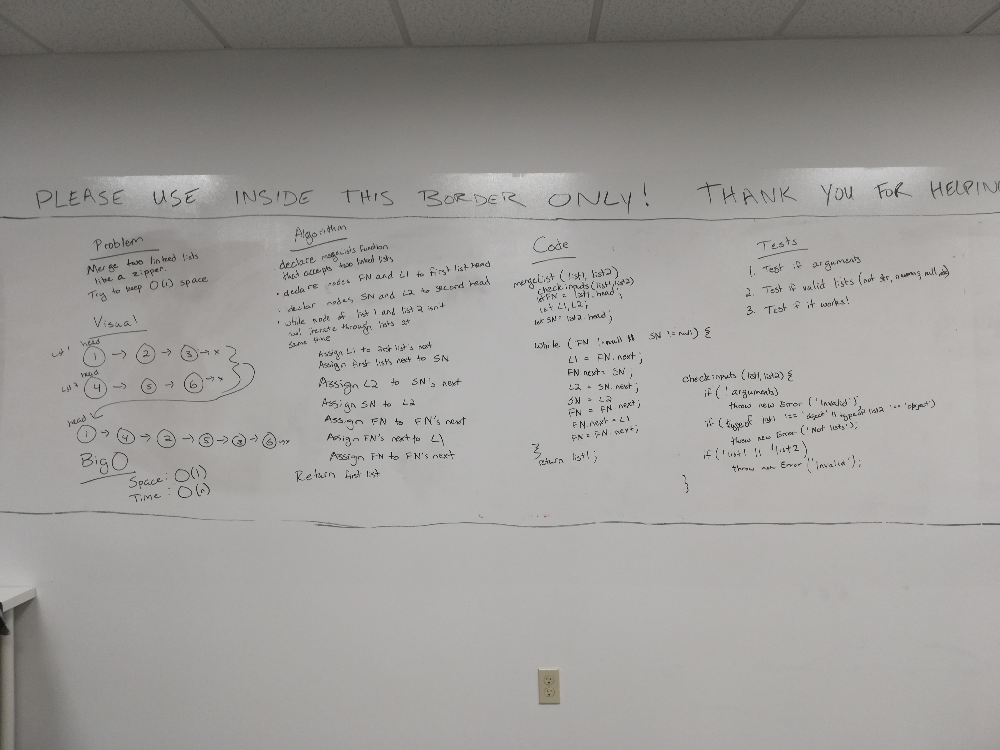

# Merge two Linked Lists

## Challenge
Write a function called mergeLists which takes two linked lists as arguments. Zip the two linked lists together into one so that the nodes alternate between the two lists and return a reference to the head of the zipped list. Try and keep additional space down to O(1). You have access to the Node class and all the properties on the Linked List class as well as the methods created in previous challenges.

## Approach & Efficiency
We took the approach of mutating the first linked list and zippering the second linked list onto it. The function then returns the first linked list. The Big O space for our solution is O(1). The Big O time for our solution is O(n).

## Solution
