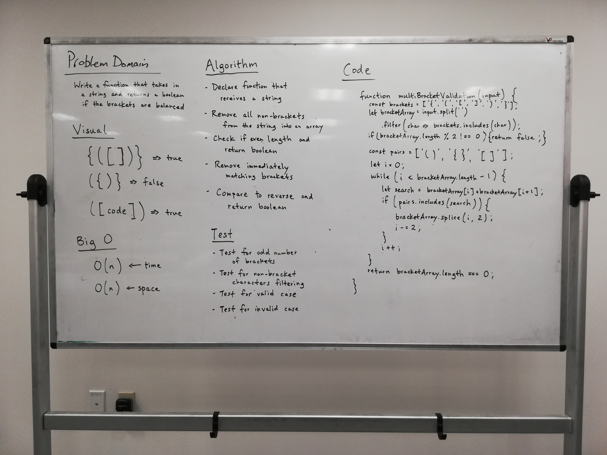

# Multi-bracket Validation.

## Challenge
Your function should take a string as its only argument, and should return a boolean representing whether or not the brackets in the string are balanced. There are 3 types of brackets:

- Round Brackets : ()
- Square Brackets : []
- Curly Brackets : {}

## Approach & Efficiency
We took the approach of splitting the input string into an array and filtering out non-bracket characters. We then return false if the length of the array is odd. If not, we iterate through the array and remove matching pairs of brackets using splice. We continue to iterate until there are no matching pairs of brackets left. We return true if the length of the array is 0 and false if it is not. The Big O time for this approach is O(n). The Big O space for this approach is O(n).

## Solution

