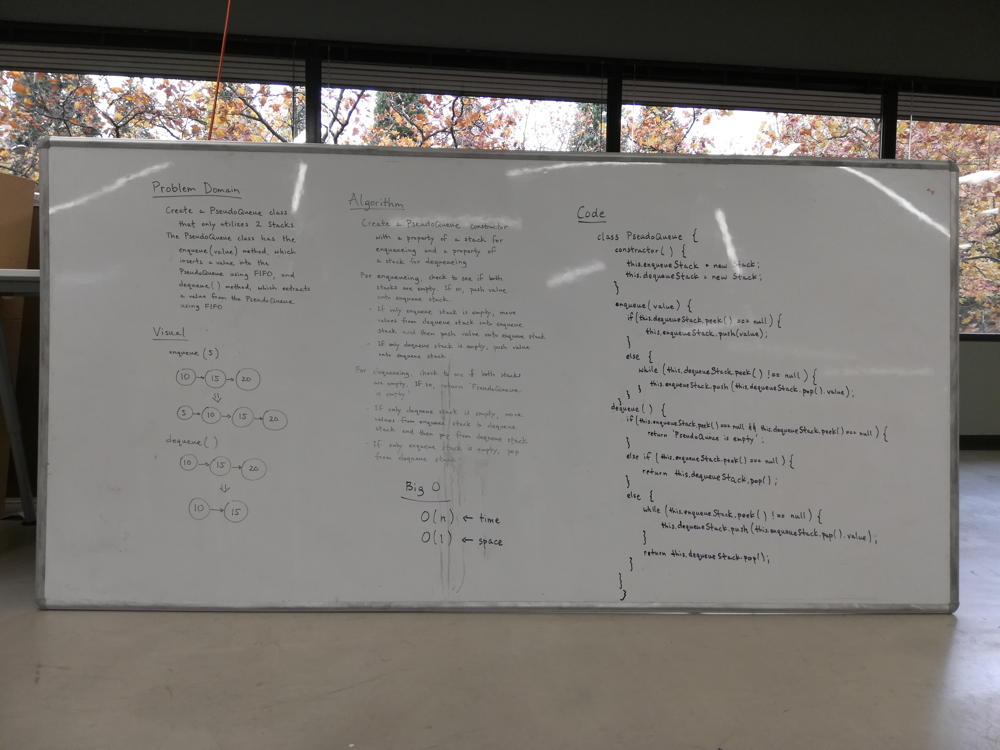

# Implement a Queue using two Stacks.

## Challenge
Create a brand new PseudoQueue class. Do not use an existing Queue. Instead, this PseudoQueue class will implement the standard queue interface, but will internally only utilize 2 Stack objects. Ensure that you create your class with the following methods:
- enqueue(value) which inserts value into the PseudoQueue, using a first-in, first-out approach.
- dequeue() which extracts a value from the PseudoQueue, using a first-in, first-out approach.
The Stack instances have only push, pop, and peek methods. You should use your own Stack implementation. Instantiate these Stack objects in your PseudoQueue constructor.

## Approach & Efficiency
We took the approach of instantiating a stack in the PseudoQueue constructor for enqueueing and instantiating a stack in the PseudoQueue constructor for dequeueing. 
- For enqueueing, if the dequeueing stack is empty, push a node with the value onto the enqueueing stack. If the dequeueing stack is not empty, first move all the nodes from the dequeueing stack onto the enqueueing stack, and then push a node with the value onto the enqueueing stack.
- For dequeueing, if both the enqueueing stack and the dequeueing stack are empty, return 'PseudoQueue is empty'. If the enqueueing stack is empty, pop a node from the dequeueing stack and return it. If the enqueueing stack is not empty, first move all the nodes from the enqueueing stack onto the dequeueing stack, and then pop a node from the dequeueing stack and return it.
The Big O time for both enqueueing and dequeueing is O(n). The Big O space for both enqueueing and dequeueing is O(1).

## Solution
