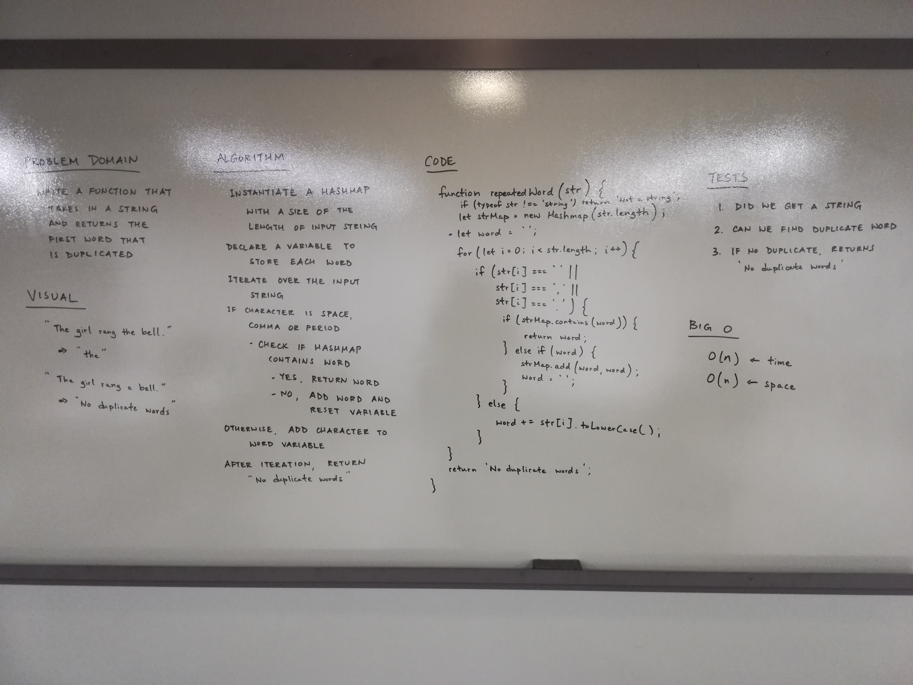

# First repeated word

## Challenge
- Write a function that accepts a lengthy string parameter.
- Without utilizing any of the built-in library methods available to your language, return the first word to occur more than once in that provided string.

## Approach & Efficiency
We took the approach of iterating through the input string and checking if each word in the string is contained in the hash table. If the word is contained in the hash table, return the word. Otherwise, add the word to the hash table. The Big O time for this approach is O(n). The Big O space for this approach is O(n).

## Solution

