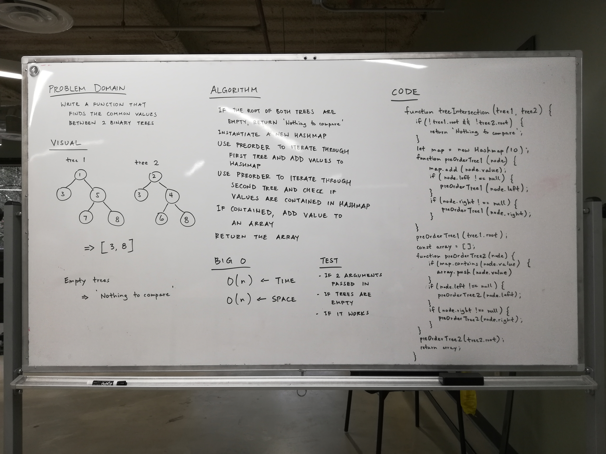

# Intersection of binary trees

## Challenge
- Write a function called tree_intersection that takes two binary tree parameters.
- Without utilizing any of the built-in library methods available to your language, return a set of values found in both trees.

## Approach & Efficiency
We took the approach of using preOrder to iterate through the first tree to add its values to the hash table. Then we used preOrder to iterate through the second tree to check if its values are contained in the hash table. If contained, we add the value to an array. Finally, we return the array. The Big O time for this approach is O(n). The Big O space for this approach is O(n).

## Solution

